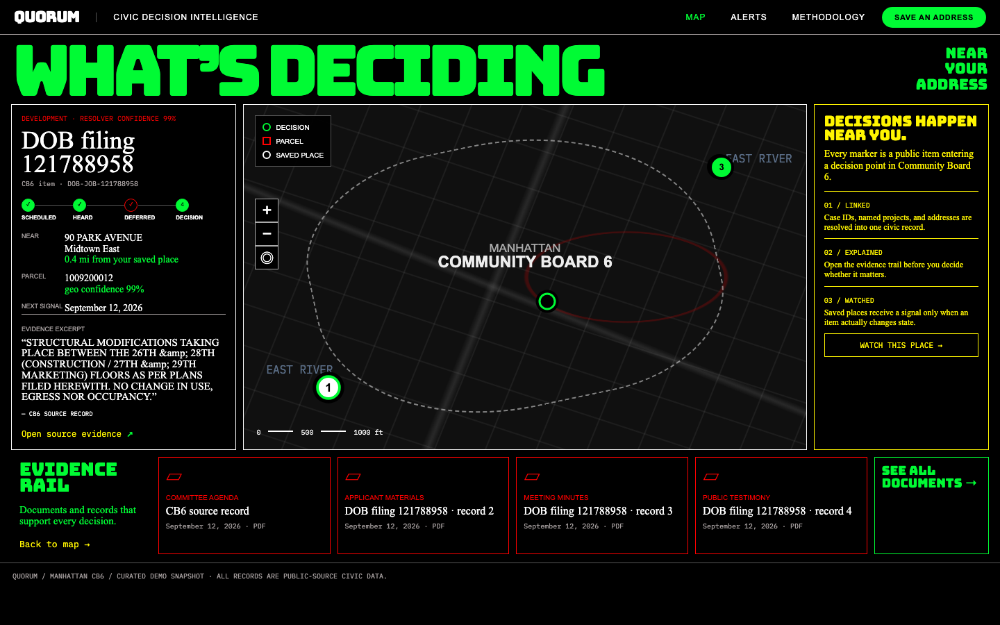
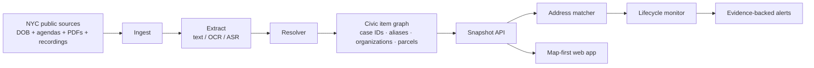

# Quorum

## Civic decision intelligence for the block around you

> **Live demo:** [quorum-lyart.vercel.app](https://quorum-lyart.vercel.app)



## Value proposition

City council, community-board, zoning, and licensing decisions are public—but typically buried in long agendas, scanned PDFs, and meeting recordings. Quorum turns those records into a map of civic decisions near a saved address, retaining the supporting evidence and alerting only at a meaningful decision point.

The demo is scoped to Manhattan Community Board 6 and NYC DOB filings. Its core question is simple: **what is being decided near this place, and why should I trust the alert?**

## Status quo

People find out about a rezoning, construction project, street redesign, or liquor-license application after it has already advanced. The raw information is available, but it is inconsistent across public portals and names the same matter differently across meetings. Existing portals make citizens do the entity resolution themselves.

## Business metrics

| Metric | Why it matters | Demo guardrail |
|---|---|---|
| Alert precision | One irrelevant alert is enough to make a user turn notifications off. | Alerts are emitted only for an address match at an approved, denied, or closed lifecycle state. |
| Entity-resolution F1 | A project should remain one record as names, case numbers, and documents change. | Gold set plus a clearly labeled silver linker baseline. |
| Lifecycle accuracy | Users should hear about a decision, not every agenda mention. | State is stored per saved place and civic item. |
| Evidence coverage | Every public-facing record needs a traceable source. | Snapshot records retain a source URL and evidence excerpt. |

## Contributors

| Name | Responsible for | Link to commits |
|---|---|---|
| Jahnavi Yelamanchi | Product, civic-data pipeline, resolver, API, monitoring flow, UI, and deployment | [Commits](https://github.com/jahnavi-yelamanchi/quorum/commits/agent/quorum-civic-demo/?author=jahnavi-yelamanchi) |

## System diagram



## Summary of outside materials

| Material | How it is used | Conditions of use |
|---|---|---|
| [NYC Open Data DOB Job Application Filings](https://data.cityofnewyork.us/Housing-Development/DOB-Job-Application-Filings/ic3t-wcy2/about_data) | Automated Manhattan CB6 development-feed connector; provides DOB job, address, BBL, status, coordinates, and public filing text. | Public NYC Open Data; retain source links. |
| NYC Community Board 6 public agendas and minutes | Fixture manifest and future document-ingestion input. | Public government records; preserve source attribution. |
| NYC MapPLUTO exports | Optional BBL, parcel, and coordinate resolution input. | NYC Planning data terms apply. |
| Tesseract | OCR fallback for scanned PDFs and images. | Apache-2.0. |
| Whisper-compatible command | Optional local transcript command for meeting audio. | Bring a locally installed model/runtime; no audio is bundled. |

## Summary of infrastructure requirements

| Requirement | How many / when | Justification |
|---|---|---|
| Vercel | One project, always on | Hosts the Vite dashboard and FastAPI serverless API. |
| SQLite | One ephemeral demo database | Lets the monitor flow work without provisioning extra services. Data may reset on a Vercel cold start. |
| Supabase (optional) | One free Postgres project | Durable saved places, monitor state, and alerts for a multi-user deployment. Schema is in `supabase/schema.sql`. |
| GitHub Actions | Weekly scheduled job | Refreshes the public CB6 DOB feed and commits a new API snapshot only when it changes. |
| Local Python environment | On demand | Runs ingestion, resolver checks, and the optional silver-linker baseline. |

## Implementation

### 1. Civic ingestion

`pipeline/ingest.py` makes hostile public inputs usable:

- Downloads or reads source files from `data/cb6_sources.json`.
- Extracts text from native PDFs with `pypdf`.
- Renders and OCRs scanned PDFs with PyMuPDF and Tesseract when necessary.
- Accepts a transcript sidecar or an external `QUORUM_ASR_COMMAND` for audio.
- Hashes raw inputs and writes an ingest report, including blocked sources, instead of silently losing them.

The automated path in `pipeline/socrata.py` queries recent Manhattan CB6 DOB filings directly from NYC Open Data—no manual CSV download required.

### 2. Resolver and civic knowledge graph

`pipeline/resolver.py` is the architectural core. It groups recurring references using case numbers, normalized addresses, title similarity, and organization names. Each resolved item retains aliases, case numbers, organizations, evidence documents, BBL, coordinates, and a confidence score.

This is intentionally a lightweight, inspectable graph representation rather than a graph database. The data model can later be moved to Postgres/Neo4j without changing the API contract.

### 3. Address matching and lifecycle monitor

`api/monitor.py` matches a saved address to an incoming civic item. Exact address matches are eligible immediately; radius matching requires coordinates. `POST /monitor/sync` tracks the previous state for each `(saved place, civic item)` pair and emits an alert only when a decision state changes.

### 4. API and product surface

`api/main.py` is a small FastAPI backend exposing:

| Endpoint | Purpose |
|---|---|
| `GET /items` | Curated, evidence-backed map items. |
| `GET /items/{item_id}/relationships` | Item aliases, case numbers, organizations, and parcel relationship nodes. |
| `GET /review-queue` | Low-confidence resolver / geo records for operator review. |
| `POST /saved-places` | Validated saved address and monitoring radius. |
| `POST /monitor/sync` | Evaluates the current snapshot and creates decision-point alerts. |
| `GET /alerts` | Alert inbox for the anonymous browser user. |

The Vite frontend in `src/` is a map-first evidence interface. It creates a browser-local anonymous ID so saved places do not share the old demo account.

### 5. Training and evaluation

`training/` contains the hand-correctable gold set plus an automated linker baseline:

- `training/gold_set.json`: canonical document-to-item, address, and lifecycle labels.
- `training/bootstrap.py`: produces recurring DOB aliases as **silver** labels.
- `training/train_linker.py`: trains a small logistic-regression linker from alias-pair features.
- `training/evaluate.py`: reports resolver F1 against the corrected gold set.

The baseline is deliberately presented as silver-quality pipeline validation, not human-verified production model quality. The deterministic resolver and evidence gate remain the source of truth for alerts.

### Project structure

```text
quorum/
├── api/                 # FastAPI routes, monitor, SQLite/Supabase stores, snapshot
├── pipeline/            # OCR/ASR-ready ingest, NYC connector, resolver, geo review
├── training/            # Gold set, silver-label bootstrap, linker baseline, eval
├── data/                # Public source manifests and small checked-in fixtures
├── src/                 # Vite + React map and alert UI
├── supabase/schema.sql  # Optional durable Postgres schema
├── docs/                # README dashboard screenshot
├── .github/workflows/   # Weekly public-source refresh
└── vercel.json          # Vite build and FastAPI routing
```

## Run locally

```bash
npm install
npm run dev
```

In another terminal:

```bash
python3 -m venv .venv
.venv/bin/pip install -r api/requirements.txt
.venv/bin/uvicorn main:app --reload --app-dir api
```

The UI calls `http://127.0.0.1:8000` in development. In production it calls the co-deployed `/api` path.

## Refresh public civic data

```bash
python3 -m pipeline.socrata --limit 20
python3 -m pipeline.build_snapshot --documents var/extracted/dob-cb6-documents.json
python3 -m pipeline.review
```

For PDFs or meeting recordings:

```bash
python3 -m pip install -r pipeline/requirements.txt
python3 -m pipeline.ingest --manifest data/cb6_sources.json
python3 -m pipeline.build_snapshot --documents var/extracted/documents.json
```

## Checks

```bash
npm run build
python3 api/check.py
python3 -m pipeline.check
python3 -m training.evaluate
```

## Deployment note

The live Vercel demo has a working FastAPI API and SQLite fallback so it requires no external setup. SQLite on serverless compute is intentionally demo-only: saved addresses and alerts can reset when the function cold-starts.

For durable multi-user monitoring, apply `supabase/schema.sql` to a Supabase project and set server-only `SUPABASE_URL` and `SUPABASE_SERVICE_ROLE_KEY` in Vercel. No `VITE_` prefix is used for the service key, so it is never exposed to the browser.

## Roadmap

- Connect live community-board agenda, minutes, and meeting-recording feeds.
- Expand human-corrected civic NER and entity-linking labels.
- Run alert precision/recall and five-meeting lifecycle tracking evaluations on a held-out gold set.
- Add authenticated accounts and durable notification delivery after the monitor is connected to Postgres.
